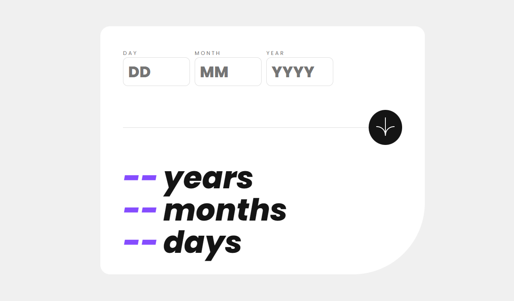

# Frontend Mentor - Age calculator app solution

This is a solution to the [Age calculator app challenge on Frontend Mentor](https://www.frontendmentor.io/challenges/age-calculator-app-dF9DFFpj-Q). Frontend Mentor challenges help you improve your coding skills by building realistic projects. 

## Table of contents

- [Overview](#overview)
  - [The challenge](#the-challenge)
  - [Screenshot](#screenshot)
  - [Links](#links)
- [My process](#my-process)
  - [Built with](#built-with)
  - [What I learned](#what-i-learned)
  - [Useful resources](#useful-resources)
- [Author](#author)
- [Acknowledgments](#acknowledgments)


## Overview

### Screenshot




### Links
- Live Site URL: [Add live site URL here](https://your-live-site-url.com)

## My process

### Built with

- Semantic HTML5 markup
- [React](https://reactjs.org/) - JS library


### What I learned

This is my first ever React mini-project. I loved working out the quirks of using a Javascript Framework for the first time. In this project I learnt how to use a custom Hook to validate forms. Learnt the useState() hook to rerender components.

A piece of code I'm proud of:
```jsx
<span className="error">{dayHasError || dateError ? `Must be a valid ${dayHasError ? "day" : "date"}` : null}</span>
```

### Useful resources

- [React Docs](https://react.dev/learn) - This is the React Docs, it helped me figure out how to handle when a user inputs something into a field and how to rerender it.

## Author

- Frontend Mentor - [@tanthehack](https://www.frontendmentor.io/profile/tanthehack)
- Twitter - [@tanielouu](https://www.twitter.com/tanielouu)

## Acknowledgments

Thank youuuu to Noah, who helped me conceptualize the formValidate.jsx custom Hook!
